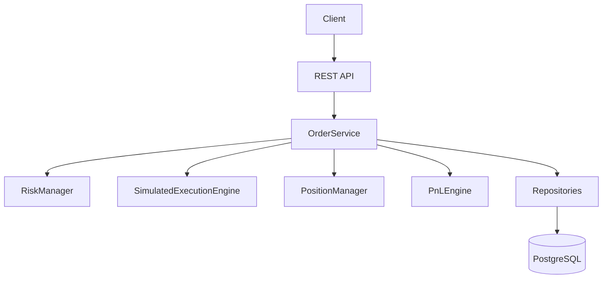
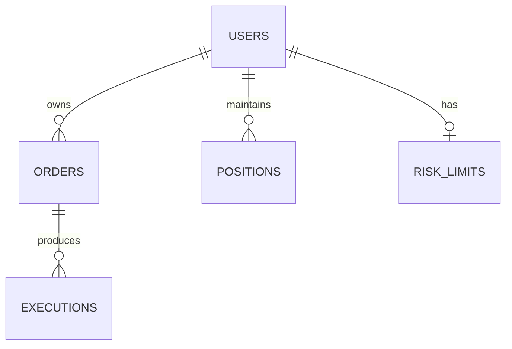

# TradeFlow

## What this project is

TradeFlow is a small but serious C++17 backend for a simplified trading-desk workflow. It demonstrates order creation, validation, risk checks, simulated execution, position tracking, realized/unrealized P&L, persistence in PostgreSQL, concurrency protection, and HTTP exposure via Crow.

This is intentionally not a real exchange or a production trading system. It is a software-engineering and quantitative-finance simulation designed for interview-level discussion and learning.

## Why this project exists

The project exists to demonstrate:

- C++17 systems design
- OOP and SOLID principles
- repository-based persistence
- risk management in trading workflows
- deterministic money handling with integer minor units
- concurrency and synchronization around shared position state
- REST API service layers and clean service orchestration
- PostgreSQL design and transaction boundaries

## Features

- Create BUY and SELL orders
- Validate order shape and business rules
- Risk checks before execution
- Simulated market/limit execution
- Immediate full-fill semantics
- Position maintenance and average-price tracking
- Realized and unrealized P&L calculations
- PostgreSQL persistence
- Idempotent order creation via `idempotency_key`
- REST API with Crow and nlohmann/json
- Unit and concurrency tests with GoogleTest

## Architecture



## Core Design

Major classes:

- `OrderService`: orchestrates the workflow
- `RiskManager`: validates against user, limit, and position rules
- `PositionManager`: applies deterministic BUY/SELL updates
- `PnLEngine`: computes realized/unrealized/total P&L
- `SimulatedExecutionEngine`: immediate simulated fill engine
- repository classes: persist order, execution, and position state
- `ThreadPool`: concurrency utility for future extensions

## Database

The project uses PostgreSQL with these tables:

- `users`
- `orders`
- `executions`
- `positions`
- `risk_limits`

ER diagram:



Run the schema and seed scripts with:

```bash
psql -h localhost -U tradeflow -d tradeflow -f sql/schema.sql
psql -h localhost -U tradeflow -d tradeflow -f sql/seed.sql
```

## Order Lifecycle

The order lifecycle is:

1. request arrives from the HTTP layer
2. validation checks request shape
3. idempotency check for duplicate requests
4. risk validation against current position and risk limit
5. simulated execution if accepted
6. position update and average-price recalculation
7. P&L calculation
8. persistence of order, execution, and position state
9. response returned to client

## Concurrency

The shared-risk problem is the main concurrency challenge: two threads cannot both read stale positions and accept orders beyond the configured limit. `OrderService` uses a mutex to protect the validation/update window so the final state remains consistent even under concurrent access.

The implementation intentionally keeps synchronization small and readable rather than broad or overengineered.

## Risk Management

The main risk model includes three quantity/limit checks:

- `maxOrderQuantity`
- `maxPositionQuantity`
- `maxNotional`

Plus business rules:

- quantity > 0
- positive limit price
- non-empty symbol
- user exists
- no short selling
- SELL cannot exceed current position

## P&L

The project stores money as integer minor units. Example:

- ₹1450.50 is stored as `145050`

Then:

- realized P&L is `quantity * (sellPrice - averagePrice)`
- unrealized P&L is `quantity * (marketPrice - averagePrice)`
- total P&L is `realized + unrealized`

This avoids floating-point accounting in the core logic.

## API Reference

See `docs/api.md`.

Example `curl` calls:

```bash
curl http://localhost:18080/health

curl -X POST http://localhost:18080/api/orders \
  -H 'Content-Type: application/json' \
  -d '{
    "user_id": 1,
    "symbol": "RELIANCE",
    "side": "BUY",
    "order_type": "LIMIT",
    "quantity": 100,
    "price": 145050,
    "idempotency_key": "demo-order-001"
  }'

curl http://localhost:18080/api/orders
curl http://localhost:18080/api/positions
curl "http://localhost:18080/api/pnl?user_id=1&symbol=RELIANCE"
curl "http://localhost:18080/api/risk?user_id=1"
```

## Quick Start

The shortest setup is:

```bash
docker compose up --build
```

Then open:

- `http://localhost:18080/health`
- `http://localhost:18080/api/orders`

## Local Development

Build with CMake:

```bash
cmake -S . -B build
cmake --build build --parallel
```

Run the API executable:

```bash
./build/tradeflow_app
```

## Tests

Run the suite with:

```bash
ctest --test-dir build --output-on-failure
```

The test set covers:

- risk validation
- position math
- P&L calculation
- service orchestration
- concurrency protections

## Example Trading Workflow

1. Create a user in the database or seed script
2. Check risk for that user
3. Submit a BUY order of 100 shares
4. View the position
5. Submit a SELL order for 50 shares
6. View total P&L
7. Attempt a risky order exceeding the configured limit
8. Retry the same order with the same idempotency key to confirm deduplication

## Design Decisions

- Why C++17: predictable high-performance backend with excellent tooling and strong systems ergonomics
- Why PostgreSQL: relational integrity, transactions, and a straightforward schema for trading data
- Why modular monolith: enough structure for clean architecture without microservice overhead
- Why interfaces: dependency inversion and testability
- Why mutexes: prevent stale position/risk reads under concurrency
- Why integer money representation: eliminate floating-point risk in financial calculations
- Why simulated execution: MVP realism without building a real exchange stack
- Why no microservices: the problem is small enough to remain easy to explain and operate

## HLD / LLD

- `docs/architecture.md`
- `docs/lld.md`
- `docs/api.md`

## Known Limitations

This project is intentionally simplified and honest about its limits:

- simulated execution only
- no real exchange
- no short selling
- no partial fills
- no authentication
- no distributed deployment
- no real market data

## Future Improvements

These are future work only and not implemented here:

- real market-data adapter
- event-driven architecture
- Kafka integration
- distributed risk service
- matching engine
- caching
- metrics and tracing
- authentication and authorization

## Interview Discussion Points

- Why modular monolith?
  Because the system is small enough to express clearly without distributed complexity.

- Why repository pattern?
  Because persistence concerns are isolated from business logic and testability improves.

- How do you prevent concurrent risk-limit violations?
  By serializing the critical validation/update path with a mutex around the decision window.

- Where is the transaction boundary?
  Around the order, execution, and position updates as one unit of work.

- What happens if execution succeeds but persistence fails?
  The transaction boundary is meant to prevent this from leaving an inconsistent system state.

- Why not double for money?
  Because floating-point arithmetic is unsafe for financial calculations.

- How would you scale this?
  By adding read replicas, separating read/write paths, and introducing a market-data and execution adapter layer.

- Where would Kafka fit?
  For downstream event propagation, monitoring, or asynchronous integration.

- How would you reduce latency?
  Through tighter lock scopes, key cache warming, and read-optimized paths.

- How would you support multiple execution venues?
  By adding venue adapters behind the same `IExecutionEngine` interface.

- How would you implement an order book?
  By adding matching logic and a real queue structure, but this is intentionally outside the MVP.

- What would you change for HFT?
  You would remove coarse locks, use lock-free or sharded structures, and build much lower-latency infrastructure.

## Final quality summary

Architecture: modular monolith with service orchestration and repository-backed persistence
Major classes: `OrderService`, `RiskManager`, `PositionManager`, `PnLEngine`, `SimulatedExecutionEngine`
Database: PostgreSQL with `orders`, `executions`, `positions`, and `risk_limits`
Concurrency: mutex-protected risk/update window and thread examples
Risk model: order-size, notional, position, and sell-cap checks
P&L model: integer minor-unit realized/unrealized/total calculations
Testing: GoogleTest suite for risk, position, P&L, order service, and concurrency
How to run: `docker compose up --build` or `cmake -S . -B build && cmake --build build`
