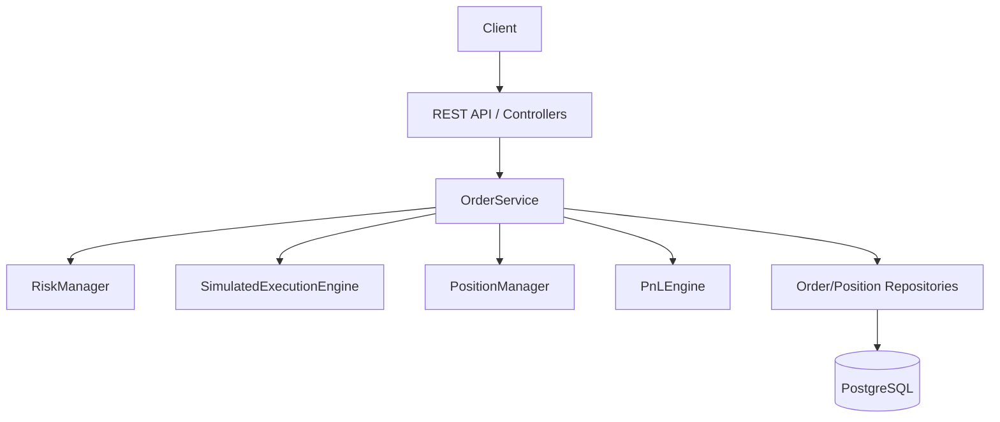
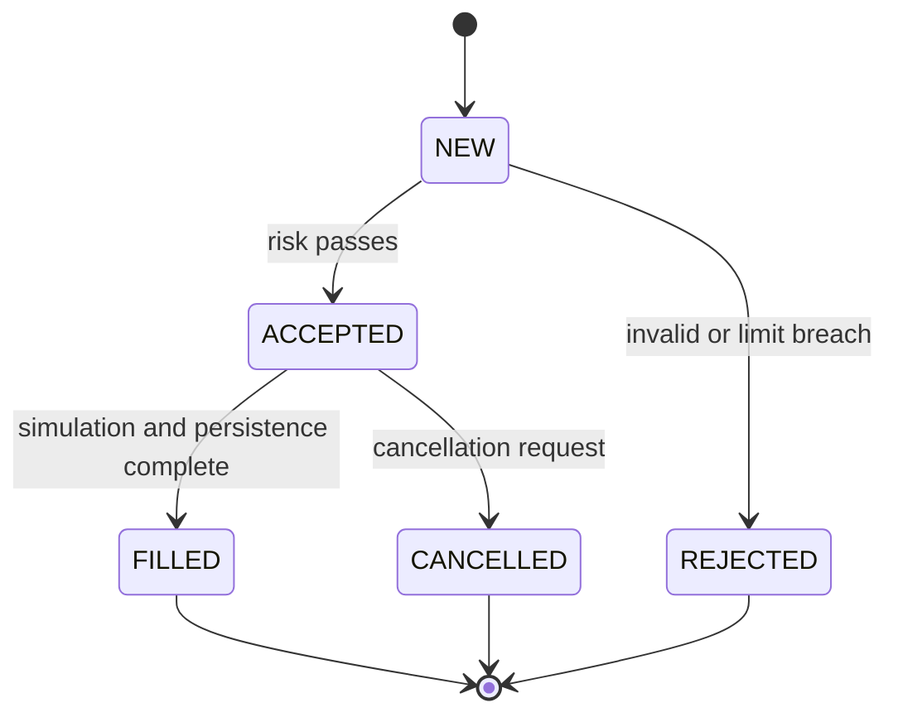
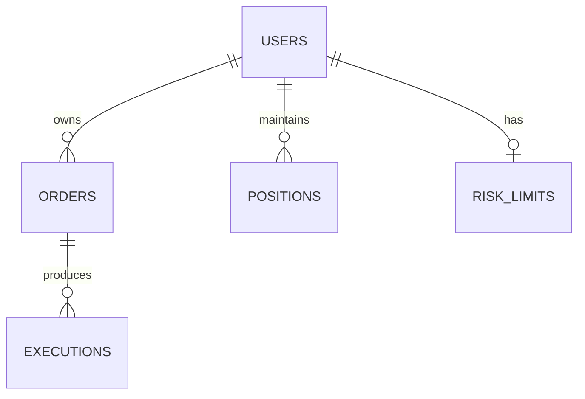

# TradeFlow Architecture

## 1. System overview

TradeFlow is a modular monolith for a simplified trading-desk backend. It accepts orders over a REST interface, validates them against user and risk rules, simulates execution, updates positions, and persists the order/execution/position data in PostgreSQL.

The code intentionally separates concerns into a small set of layers:

- API layer: HTTP request handling using Crow
- Service layer: orchestration and business workflow
- Risk layer: static validation and limit checks
- Execution layer: simulated fill engine
- Position layer: deterministic position math
- P&L layer: realized/unrealized monitoring
- Repository layer: PostgreSQL persistence abstraction

All monetary values use integer minor units (paise/cents equivalent). This keeps calculations deterministic and avoids floating-point risk in a financial-domain core.

## 2. Component diagram

## 3. Request flow

1. Client sends an order to `POST /api/orders`.
2. REST layer parses JSON into a strongly typed request DTO.
3. `OrderService` checks idempotency, resolves the current position, loads the risk limit, and calls the risk manager.
4. If accepted, the service asks the `SimulatedExecutionEngine` for a fill.
5. `PositionManager` applies the BUY/SELL delta and updates average price and realized P&L.
6. `PnLEngine` computes current unrealized P&L from an in-memory market-price provider.
7. The repository layer persists the order, execution, and position in a transaction boundary.
8. The API returns a response with order status and execution details.

## 4. Order lifecycle

## 5. Concurrency model

The critical concurrency problem is preventing stale reads in the position/risk path. `OrderService` uses a mutex to serialize the risky window:

- validate current position
- perform risk check
- compute next position state
- persist position update

This prevents one thread from accepting an order based on old position state while another thread does the same. It is intentionally small and easy to explain in interviews.

The implementation also exposes a lightweight `ThreadPool` utility for future asynchronous work.

## 6. Database interaction

PostgreSQL stores all long-lived state in small relational tables:

- users
- orders
- executions
- positions
- risk_limits

The repositories isolate SQL from business logic. The service layer orchestrates business operations and calls repository APIs. This keeps the HTTP layer from directly manipulating SQL.

## 7. Transaction boundaries

The main transaction boundary is around order creation and position update:

- persist the order row
- persist the execution row
- persist the updated position row
- commit together

If any write fails, the transaction should be rolled back. This is the main consistency boundary for a simplified trade engine.

## 8. Failure scenarios

- invalid payload: returned as `400` with a validation message
- rejected order: `422` or risk-specific response
- missing order or position: `404`
- duplicate idempotency key: returns the previously created order rather than creating a second one
- database unavailable: app can fall back to in-memory repositories in local dev mode

## 9. Scaling discussion

If this system grew to handle millions of orders, the likely next steps would be:

- read replicas for analytics/reporting
- separate read/write paths
- a dedicated market-data adapter
- a real execution gateway
- event streaming with Kafka for downstream consumers
- distributed risk services
- caching for hot symbol metadata and risk limits

The design remains modular enough to evolve without turning the monolith into unnecessary infrastructure.

## 10. Current limitations

- simulated execution only
- no real exchange connectivity
- no partial fills
- no short selling
- no real market-data service
- no authentication/authorization
- no distributed deployment

## 11. ER diagram

