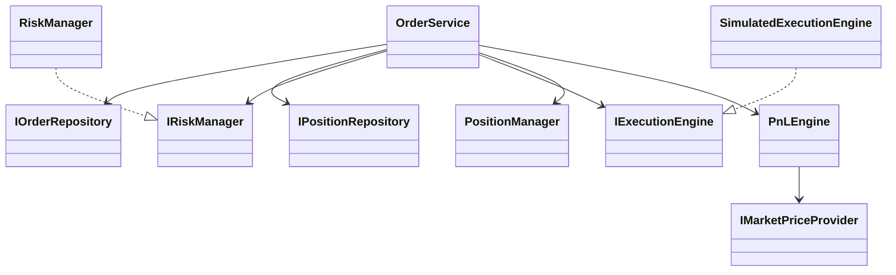

# TradeFlow Low-Level Design

## Domain models

The fundamental classes are intentionally small and domain-focused:

- `Order`: request/record state for an order
- `Position`: current net quantity, average price, realized P&L
- `Execution`: one fill record generated from a simulated execution
- `RiskLimit`: per-user risk capacity limits

The strongly typed `enum class` values for `Side`, `OrderType`, and `OrderStatus` avoid raw string business logic.

## Class responsibilities

- `OrderService`: orchestrates validation, execution, and persistence
- `RiskManager`: validates business rules and rejects unsafe orders
- `PositionManager`: applies BUY/SELL math and maintains deterministic average price logic
- `PnLEngine`: computes realized/unrealized/total P&L using market-price input
- `SimulatedExecutionEngine`: executes orders immediately at a configured market or limit price
- `PostgresOrderRepository`: persists orders and executions into PostgreSQL
- `PostgresPositionRepository`: persists positions and risk limits

## Interfaces

Interfaces are used to invert dependencies and keep the code testable:

- `IExecutionEngine`
- `IRiskManager`
- `IOrderRepository`
- `IPositionRepository`
- `IMarketPriceProvider`

This lets tests use in-memory repositories instead of requiring a live database.

## Repository pattern

Repositories own SQL concerns. They do not implement financial logic. They only persist and fetch rows. This keeps business rules in service classes and avoids mixing persistence concerns into domain logic.

## Service layer

The service layer owns the workflow:

- validate request shape
- check idempotency
- load current position and risk limits
- run risk validation
- execute fill
- update position
- persist execution and order status

This is the main orchestration boundary.

## Execution abstraction

The execution layer is an adapter-style interface. It is intentionally now implemented by a simulated provider, but the abstraction allows a future real exchange adapter without changing the service code.

## Risk abstraction

`IRiskManager` returns a structured `RiskCheckResult` rather than a bare boolean. The result includes:

- `allowed`
- `reason`

This makes API and business responses explicit and easy to monitor.

## Concurrency primitives

The concurrency model is deliberately simple:

- `std::mutex` in `OrderService` protects the critical check/update region
- `ThreadPool` demonstrates worker-queue concurrency patterns for future async tasks

The goal is not extreme throughput; it is safe, understandable coordination around shared position/risk state.

## Ownership and thread safety

- repositories and services are injected by reference or by stable ownership
- no raw owning pointers are used
- mutexes protect the shared order-service state and in-memory repositories 
- data structures are straightforward and explicit

## SOLID examples

- Single Responsibility: `PositionManager` only handles position math; `RiskManager` only handles risk validation.
- Open/Closed: new execution styles can be added through the `IExecutionEngine` interface.
- Liskov: repository implementations conform to the same `IOrderRepository` contract.
- Interface Segregation: each component depends only on the methods it needs.
- Dependency Inversion: `OrderService` depends on interfaces, not concrete implementations.

## Mermaid class diagram

